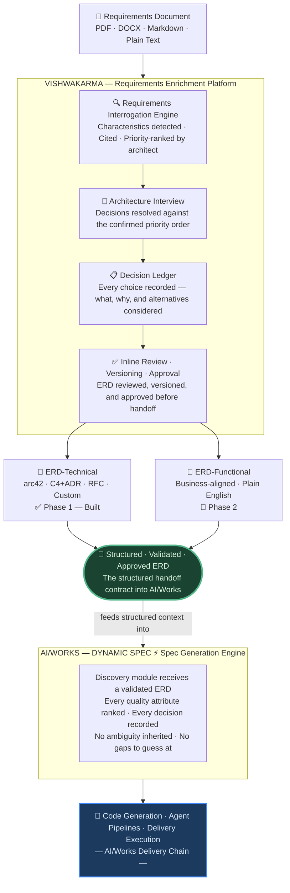

# Vishwakarma

> *The AI that interrogates your requirements before your architects have to.*

**A Requirements Enrichment Platform that transforms ambiguous business language into traceable, reviewed, and approved architectural decisions — before a single line of code is written.**

*[Setup Guide](SETUP.md) · [Report Issues](https://github.com/rohit18-tw/vishwakarma/issues)*

---

## At a Glance

| | | | |
|:---:|:---:|:---:|:---:|
| 🔍 **Requirements Interrogation** | 🎯 **Architecture Interview** | 🔁 **GitHub-Style Review & Approval** | ⚡ **AI/Works Integration** |
| Detects all quality attributes with source citations and confidence scores | Resolves every open architectural decision — scored, ranked, recorded in a Decision Ledger | Section-level threaded comments, version snapshots, structured sign-off — the PR model for architecture | Feeds a validated, approved ERD directly into Dynamic Spec — no ambiguity inherited |

---

## Table of Contents

1. [The Problem We Are Solving](#1-the-problem-we-are-solving)
2. [What Vishwakarma Brings](#2-what-vishwakarma-brings)
3. [AI/Works Ecosystem Integration](#3-aiworks-ecosystem-integration)
4. [Business Impact](#4-business-impact)
5. [Innovation & Novelty](#5-innovation--novelty)
6. [Technical / Functional Flow](#6-technical--functional-flow)
7. [Enriched Requirements Documents (ERDs)](#7-enriched-requirements-documents-erds)
8. [Design Principles & Intellectual Foundation](#8-design-principles--intellectual-foundation)
9. [Platform Capabilities — What Is Built Today](#9-platform-capabilities--what-is-built-today)
10. [Responsible AI](#10-responsible-ai)
11. [Technology Stack](#11-technology-stack)
12. [Visual Walkthrough](#12-visual-walkthrough)
13. [Quick Start](#13-quick-start)
14. [References](#14-references)

---

## 1. The Problem We Are Solving

**Architecture fails before it begins — and the industry has accepted this as normal.**

Every software project starts with a requirements document. It is handed to an architect with the instruction to *"go figure it out."* That document — almost without exception — is broken in the same ways, at the same cost, on every project.

### The Four Compounding Failures

**① Ambiguous Non-Functional Requirements**

*"The system must be fast."* *"It must be secure."* *"It should scale."*

These are not requirements. They have no threshold, no priority, no acceptance criterion. When a requirement cannot be measured, it cannot be verified — and it cannot be built correctly. Architects fill the void with assumptions. Those assumptions become design decisions. Those design decisions become constraints baked into code. **They compound invisibly — until production.**

> IBM Systems Sciences Institute quantified the cost: defects introduced during requirements definition cost **up to 100× more to fix in production** than at the point of definition.

**② Decisions Made Without Records**

Why PostgreSQL over MongoDB? Why a monolith over microservices? Why this deployment topology? When the architect who made those calls leaves the team, **the rationale disappears with them.** The next team inherits constraints with no context, rediscovers decisions that were already made, and rebuilds understanding that existed — at full cost, from zero.

**③ No Documentation Standard**

arc42, C4 Model, ADRs — these are globally recognised, industry-proven architecture documentation frameworks. Most teams produce architecture in free-form prose, whiteboards, and slide decks. Every architect translates requirements into structure differently. The output quality varies entirely by the individual. **There is no enforced standard, no repeatable process, and no shared vocabulary between roles.**

**④ Architecture Reviews Are Broken**

Email the PDF → wait days for feedback → comment in a separate document → revise → re-send → repeat. No version history. No approval trail. No traceability between a comment and the revision it triggered. No record of who approved what and when. **Weeks are lost per cycle. Nothing is auditable.**

---

### What This Costs

| Failure | Consequence at Delivery Time |
|---|---|
| Ambiguous NFRs interpreted differently by each role | Architect, BA, and product manager arrive at different systems — misalignment surfaces in code weeks later |
| No recorded trade-offs | Rework without context — teams can't distinguish intentional design from accumulated accident |
| No documentation standard | Architecture quality is a function of the individual author, not the process |
| No approval trail | Regulatory audits, post-incident reviews, and team handovers require email archaeology |

> **This is not a tooling problem. It is a requirements quality problem.**

Teams build on assumptions — not on validated architectural intent. The cost doesn't appear in requirements. It appears months later, in rework, at the worst possible time, with the fewest architectural options remaining.

**Vishwakarma intervenes at the cheapest possible moment — before any architecture is designed or any code is written.**

---

## 2. What Vishwakarma Brings

**Vishwakarma is a Requirements Enrichment Platform.** Before a single architecture section is written, it reads the requirements document the way an experienced architect would — critically. It surfaces every quality attribute buried in business prose, exposes every unresolved trade-off, and walks the architect through every open decision with scored options and explicit consequences. Nothing is assumed. Nothing is glossed over.

What comes out is not a generated document. It is a structured, traceable record of architectural intent — interrogated by the engine, decided by the architect, reviewed by the team, and approved before any design is committed or any code is written.

> *"ChatGPT generates a document. Vishwakarma generates a decision."*

---

### Four Capabilities That Set It Apart

---

#### 🔍 Requirements Interrogation Engine — *Detect. Cite. Rank.*

Upload a requirements document in any format — PDF, DOCX, Markdown, plain text. The Interrogation Engine scans business language for the architectural signal buried within prose. It surfaces every detectable architecture characteristic — each with:

- A **confidence score** derived from requirement density and linguistic weight
- The **exact source sentence** from the original document that implies it
- An **architectural explanation** of why the characteristic matters for this specific system

```
Security        95%  ← "All user data must comply with GDPR and be encrypted at rest"
Scalability     93%  ← "The platform must support 10,000 concurrent users at peak"
Availability    92%  ← "The service must maintain 99.9% uptime across all regions"
```

The architect reviews, adds anything the engine missed, removes false positives, and **reorders by priority**. This human-confirmed ranked list — not the AI's assumption — is the authoritative priority signal for every subsequent stage. **Nothing advances without architect confirmation.**

---

#### 🎯 Architecture Interview + Decision Ledger — *Resolve. Record. Trace.*

Questions are generated **specifically from the confirmed characteristics in priority order** — not a fixed template. A security-first system gets authentication and data isolation questions before concurrency. A scalability-first system gets the reverse. Every interview is different because every set of confirmed priorities is different.

For each decision:
- Multiple architectural approaches are surfaced, **scored against the team's confirmed priority ranking**
- The system recommends the best fit; the architect always decides
- Custom answers accepted at any step; any question can be skipped with the recommended answer preserved
- **Bulk accept** available when speed matters — all remaining recommendations committed with a single confirmation

Every selection is appended to the **Decision Ledger** — an append-only structured record of what was chosen, what alternatives were considered, and why. No assumption reaches the final document without a ledger entry.

---

#### 🔁 GitHub-Style Inline Review & Approval — *The PR Model for Architecture*

**Architecture is the only engineering discipline where decisions are routinely made without a traceable record.** Code has Git. Infrastructure has Terraform state. Architecture has email threads — or nothing.

Vishwakarma brings the pull request review model to architecture documentation:

- **Inline section-level commenting** — reviewers comment on the specific section they are challenging, not the document as a whole
- **Threaded comments** — replies, resolutions, and re-openings tracked; every comment anchored to the ERD version it references
- **Structured approval lifecycle**:

  ```
  Draft → Submitted for Review → In Review → Changes Requested → Approved
  ```

- **Version tracking on every ERD** — every generation, edit, and AI-assisted revision creates a named version snapshot; versions are comparable
- **Approval stamped** with reviewer attribution, version, and timestamp — if the ERD is revised after approval, the prior approval is preserved and a new review cycle begins
- **Change history as a first-class artifact** — AI-generated changes attributed to the model with the triggering prompt; human edits attributed to the author

Architecture is now reviewable, versioned, approvable, and committable to source control — alongside the code it informs.

---

#### ⚡ AI/Works Integration — *The Upstream Intelligence Layer*

> See [Section 3](#3-aiworks-ecosystem-integration) for the full integration diagram.

The entire enrichment pipeline — interrogated characteristics, resolved decisions, approved ERD — is structured specifically to serve as the **validated handoff contract into Dynamic Spec**. Dynamic Spec no longer inherits ambiguity. It receives architecture that has already been interrogated, decided, reviewed, and approved.

---

### The Two Delivery Artifacts — Enriched Requirements Documents (ERDs)

**Vishwakarma doesn't produce summaries or template fills.** It produces **Enriched Requirements Documents (ERDs)** — structured, traceable, version-stamped delivery artifacts where every element traces back to a confirmed characteristic and a Decision Ledger entry.

| Artifact | Audience | Standard | Status |
|---|---|---|---|
| **Technical ERD** | Architects, engineers | arc42 v9 · C4 + ADR · RFC · Custom | ✅ **Phase 1 — Built** |
| **Functional ERD** | Business analysts, product owners | Business-aligned · Plain English · Quality attributes as functional criteria | 🔄 **Phase 2** |

One pipeline. Two role-appropriate delivery artifacts. The misalignment that normally surfaces weeks into a project is resolved at source.

---

## 3. AI/Works Ecosystem Integration

> **Vishwakarma is the upstream intelligence layer in the AI/Works delivery chain.**

Dynamic Spec's discovery module currently consumes raw requirements documents. When those documents are ambiguous — and they almost always are — Dynamic Spec inherits every gap, every unresolved trade-off, and every unstated constraint. **The spec it generates is only as good as the requirements it received.**

Vishwakarma removes that constraint. The output of the enrichment pipeline is not a document — it is a **structured, validated, approved contract** that Dynamic Spec can consume with full confidence.



When Dynamic Spec consumes a Vishwakarma ERD, it receives a document that has already:

- **Detected and priority-ranked** every quality attribute with source evidence from the original document
- **Resolved every open architectural decision** with rationale, alternatives, and trade-offs recorded in the Decision Ledger
- **Applied recognised documentation standards** — arc42 v9, C4 Model, ADR — enforced by the engine, not by the author's skill
- **Passed through inline review and approval** — versioned, attributed, and signed off before handoff

> **Better input. Better spec. Better code.**

---

## 4. Business Impact

**Requirements quality is a business problem, not an engineering problem.** Every ambiguous requirement, every unstated constraint, every unrecorded trade-off is not a documentation gap — it is a deferred cost that will surface later, at a higher price, with fewer architectural options remaining.

**Vishwakarma intervenes at the cheapest possible moment.**

### Quantified Impact

| Metric | Without Vishwakarma | With Vishwakarma |
|---|---|---|
| Time to traceable architecture artifact | 3–6 weeks of workshops and authoring | 20–40 minutes |
| Quality attribute coverage | Whatever the architect remembers | Every detectable characteristic, each with source evidence and confidence score |
| Decision traceability | Meeting notes, email threads, tribal knowledge | Decision Ledger — every choice, rationale, and alternative recorded |
| Stakeholder alignment | Multiple mental models, resolved through workshops | Single interrogated source of truth |
| Architecture review cycle | 1–2 weeks per email-and-revise cycle | Inline comments → approval → versioned sign-off — same session |
| Documentation standards | Varies by author skill and available time | arc42 v9 · C4 Model · ADR — enforced by the engine |
| ERD version and approval history | Non-existent | Full version history + approval trail committed to source control |
| Downstream AI agent quality | Constrained by raw, ambiguous input | Structured, validated, approved ERD as input |

### The Compounding Cost of Deferred Decisions

Every unresolved requirement becomes an assumption. Every assumption becomes a codebase constraint. Every constraint becomes a blocker on future change. **The cost doesn't disappear — it defers and compounds.** An architecture characteristic detected during requirements interrogation costs minutes. The same characteristic discovered during a production incident costs orders of magnitude more.

### Organisational Governance Impact

Traditional Architecture Review Boards are slow, centralised, and — as Thoughtworks Architecture Advice Process research confirms — **correlated with low organisational performance**. Vishwakarma's versioned ERD with inline review and approval is the infrastructure that makes decentralised architectural governance safe: teams decide, the Decision Ledger captures it, the approval workflow validates it. Architecture Review Boards become unnecessary — not because governance was removed, but because it was made continuous, lightweight, and embedded in delivery.

### Architectural Review Tracking — The Business Case

| Scenario | Without Tracking | With Vishwakarma |
|---|---|---|
| **Regulatory audit** | "Who approved the authentication architecture?" — answered with email searches and meeting recalls | Version-stamped approval trail exportable in minutes |
| **Team handover** | New architect reads the system for weeks, rediscovers decisions already made, rebuilds context that existed | Complete version history + Decision Ledger shows exactly what was decided and why, from day one |
| **Architecture rework** | No record of what was intentional vs. what was a workaround — everything is treated as fixed | Every decision has a rationale; intentional trade-offs are distinguished from reckless assumptions |
| **Post-incident review** | "Why was this built this way?" — unanswerable without the people who were there | Decision Ledger entry for every architectural choice, with the alternative options that were considered |
| **Compliance** | Architecture decisions distributed across email, Confluence, Slack, tribal memory | Single, versioned, approved, exportable ERD that satisfies architecture governance requirements |

---

## 5. Innovation & Novelty

**Business impact is the core ideology.** Requirements quality is not a documentation concern — it is a delivery cost driver. IBM Systems Sciences Institute: defects introduced during requirements definition cost **up to 100× more to fix in production** than at the point of definition. Vishwakarma cuts that cost by making decisions explicit before they become assumptions baked into code.

### Built on Thoughtworks Engineering Principles

Vishwakarma is not built on novel ideas in isolation — it is built on **industry-proven Thoughtworks principles**, applied systematically at the point where they have been most absent: requirements time. These are not references added for credibility. They are enforcement rules baked into every prompt, every schema field, and every generated document section.

| Principle | Thoughtworks Source | How Vishwakarma Enforces It |
|---|---|---|
| **Architecture Advice Process** | Tech Radar Vol. 32, April 2025 — Trial | Inline review + approval workflow replaces Architecture Review Boards with continuous, decentralised governance |
| **Lightweight ADRs** | Tech Radar 2018 — Adopt | First-class output in every Technical ERD; noun-phrase titles, active-voice decisions, split consequences, immutable once accepted |
| **Evolutionary Architecture & Fitness Functions** | Ford, Parsons, Kua, Sadalage — Thoughtworks/O'Reilly 2022 | Every measurable NFR must declare how it will be verified in CI/CD — enforced in arc42 Section 6 generation |
| **Domain-Driven Design** | Martin Fowler — Bounded Context | arc42 Section 5 and C4 Container decomposition enforced by business capability, not technology layer |
| **Team Topologies** | Skelton & Pais, 2nd ed. September 2025 | Every C4 container must identify its owning team type — stream-aligned, platform, enabling, complicated-subsystem |
| **Conway's Law** | Martin Fowler | Team ownership check enforced in every C4 container diagram; mismatches surfaced as reviewer challenges |
| **Technical Debt Quadrant** | Martin Fowler | arc42 Section 11 classifies debt as prudent-deliberate or reckless — not a flat inventory |
| **Observability as Engineering Discipline** | Thoughtworks — OpenTelemetry (Adopt) | All three pillars — logs, metrics, traces — required in generated ERDs with a named approach |

> These are the principles that separate architecture that survives from architecture that gets rewritten.

---

### 5.1 The Characteristics-to-Interview Pipeline

*The structural differentiator that no amount of prompt engineering alone can replicate.*

**Detect.** The Requirements Interrogation Engine scans the document and surfaces all detectable architecture characteristics — each with a confidence score and the exact source sentence that implies it.

**Prioritise.** The architect reviews detected characteristics and **reorders them by priority**. This is the critical human signal:
- *Customisable:* Add characteristics the engine missed; remove false positives
- *Human-in-the-loop:* Nothing reaches the next stage without architect confirmation
- *Priority-driven:* The ranked list — not the AI's assumption — governs the interview, the scoring, and the document

**Interview.** Questions are generated specifically for the confirmed characteristics, in priority order. A security-first system gets authentication and data isolation questions before concurrency. A scalability-first system gets the reverse. The interview is different for every document.
- *Suggestive:* Each question presents multiple approaches, scored against the confirmed ranking
- *Customisable:* Every answer can be accepted, overridden with a custom response, or skipped
- *Human-in-the-loop:* The system recommends the best fit; the architect always decides

**Ledger.** Every selection is recorded in the **Decision Ledger** — an append-only structured record of what was chosen, what alternatives were considered, and why. No assumption reaches the final document without a ledger entry.

> *"We interview the system, not the person."*

---

### 5.2 Architectural Review Tracking with Version History & Approval

**Architecture is the only engineering discipline where decisions are routinely made without a traceable record.** Code has Git. Infrastructure has Terraform state. Architecture has email threads — or nothing.

Vishwakarma introduces **Architectural Review Tracking** as a first-class platform capability: every ERD is not just a document but a version-controlled, reviewable, approvable artifact. The complete history of how an architecture evolved — from first generation to final sign-off — is preserved, queryable, and exportable alongside the code it informed.

Architecture reviews today: email the PDF → wait for feedback → revise → re-send → repeat. No version history. No approval record. Weeks per cycle.

**Vishwakarma brings the pull request review model to architecture documentation.**

**Inline section-level commenting**
- Reviewers comment on the specific section, paragraph, or diagram they are challenging — not the document as a whole
- Comments are threaded: replies, resolutions, and re-openings tracked
- Every comment is anchored to the version of the ERD it references

**Structured approval lifecycle**
```
Draft → Submitted for Review → In Review → Changes Requested → Approved
```
- Reviewers get a direct link to the specific ERD version — no email thread, no shared document
- Approval is stamped with reviewer, version, and timestamp
- If the ERD is revised after approval, the prior approval is preserved and a new review cycle begins

**Version tracking on every ERD**
- Every generation, every edit, and every AI-assisted revision creates a named version snapshot
- Versions are comparable — see exactly what changed between v1 and v3 and which comment triggered each revision

**Change history as a first-class artifact**
- AI-generated changes attributed to the model with the triggering prompt
- Human edits attributed to the author with a timestamp
- Change log exportable and committable to source control alongside the code

---

### 5.3 Live Presentation Mode for Architecture Diagrams

*Eliminates the "export to PowerPoint" workflow entirely.*

- **Progressive reveal:** C4 hierarchy presented level by level — Context, Container, Component — each revealed on a click, like a slide deck, without being a slide deck
- **Live diagram queries during the session:** Stakeholders ask questions; the architect queries the diagram live and receives answers grounded in the generated architecture — in the room, not in a follow-up email
- **No preparation overhead:** The reviewed, approved ERD *is* the presentation surface — no re-export, no re-format, no slide preparation

---

## 6. Technical / Functional Flow

Four stages. Each builds on the previous. Full traceability from the original requirements sentence to the final approved architecture document.

---

### Stage 1 — Ingest

Accepts **PDF, DOCX, Markdown, plain text, Confluence exports.** No pre-processing required.

| Track | Audience | Output |
|---|---|---|
| **Technical** | Architects, engineers | arc42 · C4+ADR · RFC — C4 diagrams + ADRs |
| **Functional** | Business analysts, product owners | Plain-English ERD with quality attribute mapping |
| **Both** | Full delivery team | One pipeline run. Two complete delivery artifacts. |

---

### Stage 2 — Requirements Interrogation Engine

Surfaces all detectable architecture characteristics per document. Each includes:
- **Confidence score** — derived from requirement density and linguistic weight
- **Source sentence** — the exact line in the original document that implies it
- **Architectural explanation** — why this characteristic matters for this system

The architect reviews, adds missed characteristics, removes false positives, and **reorders by priority**. This ranked list — confirmed by a human — is the authoritative decision context for every subsequent stage.

---

### Stage 3 — Architecture Interview

Generates targeted questions for every open architectural decision — derived from confirmed characteristics in priority order. For each decision:
- Multiple architectural approaches surfaced, scored against the confirmed priority ranking
- Trade-offs shown explicitly before the architect chooses
- Architect selects; system proposes best fit automatically but confirmation is always required
- Custom answers accepted at any point; any question can be skipped
- **Bulk accept** available — all recommended answers committed simultaneously when speed matters

Every selection is appended to the **Decision Ledger** — append-only, no assumption reaches the document without a ledger entry.

---

### Stage 4 — ERD Generation + Review + Approval

The architect selects the documentation framework. The platform generates the complete ERD in real time — section by section via live streaming — grounded in confirmed characteristics and Decision Ledger entries. The ERD then enters the inline review and approval workflow before any design is committed or code is written.

---

## 7. Enriched Requirements Documents (ERDs)

An **Enriched Requirements Document** is neither a summary nor a template fill. It is the output of a structured interrogation — ambiguities resolved, decisions explicit, standards applied, every output element traceable to source. The ERD is a living, versioned artifact with a full review and approval lifecycle.

---

### Technical ERD *(Phase 1 — Built)*

| Framework | Standard | Best Suited For |
|---|---|---|
| **arc42 v9** | 12-section international architecture documentation standard | Enterprise systems, regulated industries, complex programmes |
| **C4 + ADR** | Simon Brown's C4 model + Martin Fowler ADR format | Microservices, diagram-first teams, API-oriented systems |
| **RFC** | Engineering Request for Comments | Open review culture, collaborative architectural governance |
| **Custom** | User-defined section structure | Teams with existing standards to preserve |

Every Technical ERD includes: framework sections derived from the pipeline · ADRs with trade-off cards · C4 diagrams in Mermaid v11 with ELK auto-layout · Live Presentation Mode · inline review and commenting · version tracking · approval workflow · change history · ZIP export (source-control ready).

---

### Functional ERD *(Phase 2)*

Same interrogation pipeline. Business-aligned output. Architecture characteristics surface as functional quality attributes — Security → data handling policy, Scalability → expected load projections, Availability → service level commitments. Same Decision Ledger, same version and approval history. Business and technical teams start from the same validated ground truth.

---

### Both Tracks

One upload. One pipeline run. Two complete, role-appropriate delivery artifacts — reviewed through the same approval workflow, versioned together. The misalignment that normally surfaces weeks into a project is resolved at source.

---

## 8. Design Principles & Intellectual Foundation

Every prompt rule, schema field, and generated document section traces directly to these sources.

---

### Architecture Decision Records

ADRs are a first-class output in every Technical ERD — not an appendix. Format enforced from **Martin Fowler's canonical definition** and **Thoughtworks Lightweight ADR** (Tech Radar 2018 — Adopt):

- Noun-phrase titles · Active-voice decisions ("We will use X") · Every alternative listed with pros *and* cons · Consequences split: benefits and trade-offs separately · Status: Proposed → Accepted → Superseded (never modified, only superseded)

The **Architecture Advice Process** (Thoughtworks Tech Radar Vol. 32, April 2025 — Trial) is the governance rationale: Architecture Review Boards correlate with low organisational performance. Decentralised decisions are safe only when recorded and reviewed — ADRs and Vishwakarma's approval workflow provide that.

> [Martin Fowler — ADR](https://martinfowler.com/bliki/ArchitectureDecisionRecord.html) · [Thoughtworks — Lightweight ADRs](https://www.thoughtworks.com/radar/techniques/lightweight-architecture-decision-records) · [Architecture Advice Process](https://www.thoughtworks.com/radar/techniques/architecture-advice-process)

---

### C4 Model

Rules enforced from **Simon Brown's specification**: Context — system boundary, persons, external systems only (max 10 elements, no technology terms); Container — every deployable unit with technology annotation (max 15 elements); all edges include protocol labels; all nodes use C4 bracket notation; Conway's Law check — every container states its owning team, mismatches surfaced as reviewer challenges.

> [C4 Model — Simon Brown](https://c4model.com/introduction) · [Conway's Law — Martin Fowler](https://martinfowler.com/bliki/ConwaysLaw.html)

---

### Evolutionary Architecture & Fitness Functions

Every measurable NFR must state how it will be automatically verified in the CI/CD pipeline — from **Building Evolutionary Architectures** (Ford, Parsons, Kua, Sadalage — Thoughtworks / O'Reilly, 2022). *"We need 99.9% availability"* is a wish. *"Verified by a Datadog SLO monitor targeting 99.9% over a 30-day rolling window"* is a fitness function — aligned with **Fitness Function-Driven Development** (Thoughtworks, 2019).

> [Building Evolutionary Architectures](https://www.thoughtworks.com/insights/books/building-evolutionary-architectures-second-edition) · [Fitness Function-Driven Development](https://www.thoughtworks.com/en-us/insights/articles/fitness-function-driven-development)

---

### Domain-Driven Design — Decomposition by Business Capability

Decomposition in arc42 Section 5 and C4 Container diagrams enforces **DDD strategic patterns** from **Fowler's Bounded Context**. A frontend/backend/database split violates DDD and Conway's Law simultaneously — it organises by technology layer, not business capability. The engine flags non-capability-aligned decompositions.

> [Bounded Context — Fowler](https://martinfowler.com/bliki/BoundedContext.html) · [Microservices — Fowler & Lewis](https://martinfowler.com/articles/microservices.html) · [Monolith First — Fowler](https://martinfowler.com/bliki/MonolithFirst.html)

---

### Technical Debt · Observability · Team Topologies

**Technical Debt:** arc42 Section 11 requires classification by **Fowler's Technical Debt Quadrant** — prudent-deliberate is a trade-off; reckless-deliberate is a liability. The distinction is made explicit in every ERD. → [Technical Debt Quadrant](https://martinfowler.com/bliki/TechnicalDebtQuadrant.html)

**Observability:** All three pillars — logs, metrics, traces — as a unified concern. **OpenTelemetry** (Thoughtworks Tech Radar — Adopt) is the recommended standard. → [Observability as a Leadership Choice](https://www.thoughtworks.com/insights/blog/technology-strategy/drowning-in-dashboards-starving-for-clarity-why-observability-is-a-leadership-choice)

**Team Topologies:** Every C4 container must identify its owning team by type (stream-aligned, platform, enabling, complicated-subsystem) — from **Team Topologies** (Skelton & Pais, 2nd ed. September 2025). → [Team Topologies](https://teamtopologies.com/key-concepts) · [Thoughtworks Tech Radar Vol. 32](https://www.thoughtworks.com/content/dam/thoughtworks/documents/radar/2025/04/tr_technology_radar_vol_32_en.pdf)

---

## 9. Platform Capabilities — What Is Built Today

| Capability | Status |
|---|---|
| Requirements ingestion — PDF, DOCX, Markdown, plain text | ✅ Built |
| Requirements Interrogation Engine — all detectable characteristics with confidence scores and source evidence | ✅ Built |
| Architecture characteristics priority ranking — human-confirmed, machine-readable priority vector | ✅ Built |
| Customisable characteristics — add, remove, reorder | ✅ Built |
| Architecture Interview — questions derived from confirmed priority order, not a fixed template | ✅ Built |
| Suggestive interview — scored approaches per decision; recommended best fit surfaced automatically | ✅ Built |
| Human override — every recommendation overridable; custom answers accepted at any step | ✅ Built |
| Bulk interview accept — all recommended answers committed simultaneously | ✅ Built |
| Decision Ledger — append-only record of every choice, rationale, and alternatives | ✅ Built |
| ERD-Technical — arc42 v9 (12 sections, section-level rules enforced) | ✅ Built |
| ERD-Technical — C4 + ADR (strict C4 schema + Fowler ADR format) | ✅ Built |
| ERD-Technical — RFC format | ✅ Built |
| ERD-Technical — Custom section structure | ✅ Built |
| Live streaming generation — section-by-section, server-sent events | ✅ Built |
| Architecture Decision Records — full alternatives, pros/cons, split consequences | ✅ Built |
| C4 diagrams — Mermaid v11 with ELK auto-layout, Context + Container + Component | ✅ Built |
| **Live Presentation Mode** — full-screen progressive C4 diagram reveal | ✅ Built |
| **Diagram query** — natural-language questions against rendered diagrams, live during presentations | ✅ Built |
| Inline section editing with AI conversational edits | ✅ Built |
| **GitHub-style inline review and commenting** — section-level threaded comments, anchored to versions | ✅ Built |
| **ERD version tracking** — named snapshots on every change; versions comparable | ✅ Built |
| **Approval workflow** — Draft → In Review → Approved; reviewer attribution and version stamps | ✅ Built |
| **Change history** — AI and human changes attributed, timestamped, logged | ✅ Built |
| Export — ZIP of Markdown, diagrams, ADRs, and approval history; source-control ready | ✅ Built |
| Track selector — Technical / Functional / Both | ✅ Built |
| ERD-Functional — business analyst-facing document generation | 🔄 Phase 2 |
| Dynamic Spec integration — structured ERD handoff to downstream agents | 🔜 Phase 3 |

---

## 10. Responsible AI

**The AI proposes. The human decides.** At no point does the platform make an autonomous architectural decision.

| Principle | How It Is Enforced |
|---|---|
| **Human-in-the-loop at every stage** | Architect confirms characteristics, ranks priority, selects interview answers. No characteristic or decision reaches the next stage without explicit confirmation. Approval workflow extends this to all reviewers — no ERD version is final without explicit sign-off. |
| **Suggestive, not prescriptive** | The system recommends the best-fit approach for every interview decision, scored against the team's confirmed priorities. Every recommendation is overridable. Custom answers accepted at any step. |
| **Cites, not asserts** | Every detected characteristic is traced to the source sentence in the original document — grounded in evidence the architect can verify, not in what the model would expect to find there. |
| **Complete audit trail** | Decision Ledger records every choice with what was considered and why. Approval history records every sign-off. AI-generated changes attributed to the model with the triggering prompt. Human edits attributed to the author. Nothing is a black box. |
| **Full output traceability** | Every section of the generated ERD traces back to a confirmed characteristic and a Decision Ledger entry. The architecture is derived — not generated. |

---

## 11. Technology Stack

| Layer | Technology |
|---|---|
| Frontend | React 18 + TypeScript + Vite |
| Backend | Python 3.11+ + FastAPI + Pydantic v2 |
| AI Engine | Anthropic Claude — Streaming SSE |
| Diagrams | Mermaid v11 + ELK Auto-layout |
| Architecture Standards | arc42 v9 · C4 Model · ADR (MADR) |
| Session Storage | File-based (demo-ready) |

---

## 12. Visual Walkthrough

The complete end-to-end flow from requirements document to approved architecture. Each screenshot below shows a distinct stage in the pipeline — the journey from raw ambiguous text to a reviewed, version-stamped, approved Enriched Requirements Document.

---

### Step 1 — Requirements Upload and Track Selection

Upload the requirements document in any format. Select the output track — Technical, Functional, or Both. The track selection is not a filter applied at the end — it shapes how the engine reads the document from the first sentence. Business analysts and architects both start here; the pipeline diverges from this choice.


---

### Step 2 — Characteristics Detection and Priority Ranking

The Interrogation Engine returns detected quality attributes with confidence scores and the exact source sentences that imply them. The architect reviews all findings — adding characteristics the engine missed, removing false positives — and **drags to reorder by priority**. This ranked list is the machine-readable priority signal that governs the interview, the scoring, and the entire generated document. Nothing this precise is possible from a raw document alone.


---

### Step 3 — Architecture Interview — Scored Options and Decision Selection

Questions are derived from the confirmed characteristics in priority order — not a fixed template. Each question presents multiple architectural approaches scored against the team's confirmed ranking. The architect selects the best fit or overrides with a custom answer. **Bulk accept** commits all remaining recommended answers simultaneously when speed matters.


Every individual answer is recorded in the Decision Ledger immediately.


When time is constrained, the entire remaining interview can be accepted in one confirmed action — all recommended answers committed, all recorded.


---

### Step 4 — Documentation Framework Selection

Four standards-aligned frameworks are available once all decisions are resolved. The selection determines the structure, section rules, and documentation standard applied to the generated ERD. The Custom option preserves existing team standards.


Custom section structure editor — define exactly which sections the ERD should contain.


---

### Step 5 — Generated Technical ERD with Inline Editing

The complete ERD is generated in real time, section by section via live streaming. Architecture Decision Records with full trade-off cards are generated inline. Any section can be edited directly or revised through conversational AI prompts without regenerating the full document.


---

### Step 6 — C4 Architecture Diagrams

Context and Container level diagrams generated and rendered live in Mermaid v11 with ELK auto-layout. Compliant with Simon Brown's C4 specification. Immediately queryable in natural language from within the platform.


---

### Step 7 — Live Presentation Mode

Full-screen presentation mode built directly on the generated C4 diagrams — no export, no PowerPoint, no preparation. The C4 hierarchy is revealed level by level on click. Stakeholders can ask questions in natural language and receive answers grounded in the generated architecture, live in the room.


Configurable timing for automatic progression, or manual control for stakeholder-driven sessions.


---

### Step 8 — Submit ERD for Architectural Review

Once the author is satisfied, the ERD is submitted for review. The reviewer receives a direct link to the specific ERD version — no email thread, no shared editing, no version confusion.


---

### Step 9 — Reviewer Dashboard with Version History

The reviewer dashboard shows every ERD pending sign-off, the version it is currently at, and the complete version history of how the document evolved. Reviewers see exactly what changed between versions and which comment triggered each revision.


---

### Step 10 — GitHub-Style Inline Review and Approval

Reviewers comment on specific sections — not the document as a whole. Comments are threaded, anchored to the version they reference, and tracked through to resolution. The approval is version-stamped with reviewer attribution and timestamp. This is the pull request review model applied to architecture documentation.


---

### Step 11 — Phase 2 Preview — Functional ERD

Same interrogation pipeline. Business-aligned output. Architecture characteristics are surfaced as functional quality attributes — Security becomes a data handling policy, Scalability becomes expected load projections, Availability becomes service level commitments. Business and technical teams start from the same interrogated, approved source of truth.


---

## 13. Quick Start

Full setup in **[SETUP.md](SETUP.md)**.

```bash
# 1. Start the database layer
docker compose up -d

# 2. Configure and start the backend
cd app/backend && pip install -e .
# Add ANTHROPIC_API_KEY to .env
cd .. && ./start-backend.sh

# 3. Start the frontend
cd app/frontend && npm install && npm run dev

# → http://localhost:5173
```

---

## 14. References

The intellectual grounding of the platform — every prompt rule, schema field, and generated document section traces to one of these.

### Architecture Decision Records
| | |
|---|---|
| Architecture Decision Record — Martin Fowler | https://martinfowler.com/bliki/ArchitectureDecisionRecord.html |
| Documenting Architecture Decisions — Michael Nygard | https://cognitect.com/blog/2011/11/15/documenting-architecture-decisions |
| Lightweight ADRs — Thoughtworks Tech Radar (Adopt) | https://www.thoughtworks.com/radar/techniques/lightweight-architecture-decision-records |
| Architecture Advice Process — Thoughtworks Vol. 32, April 2025 (Trial) | https://www.thoughtworks.com/radar/techniques/architecture-advice-process |

### Architecture Diagrams & Documentation Standards
| | |
|---|---|
| C4 Model — Simon Brown | https://c4model.com/introduction |
| arc42 Architecture Documentation Standard | https://arc42.org/overview |

### Evolutionary Architecture & Fitness Functions
| | |
|---|---|
| Building Evolutionary Architectures — Thoughtworks / O'Reilly (2022) | https://www.thoughtworks.com/insights/books/building-evolutionary-architectures-second-edition |
| Fitness Function-Driven Development — Thoughtworks | https://www.thoughtworks.com/en-us/insights/articles/fitness-function-driven-development |
| Evolutionary Architecture Decoder — Thoughtworks | https://www.thoughtworks.com/en-us/insights/decoder/e/evolutionary-architecture |

### Domain-Driven Design & Microservices
| | |
|---|---|
| Bounded Context — Martin Fowler | https://martinfowler.com/bliki/BoundedContext.html |
| Domain-Driven Design — Martin Fowler | https://martinfowler.com/bliki/DomainDrivenDesign.html |
| Microservices — Martin Fowler & James Lewis | https://martinfowler.com/articles/microservices.html |
| Monolith First — Martin Fowler | https://martinfowler.com/bliki/MonolithFirst.html |

### Conway's Law & Team Topologies
| | |
|---|---|
| Conway's Law — Martin Fowler | https://martinfowler.com/bliki/ConwaysLaw.html |
| Team Topologies — Skelton & Pais (2nd ed. September 2025) | https://teamtopologies.com/key-concepts |
| Team Topologies — Thoughtworks Podcast | https://www.thoughtworks.com/insights/podcasts/technology-podcasts/team-topologies |

### Technical Debt, Observability, Technology Radar
| | |
|---|---|
| Technical Debt Quadrant — Martin Fowler | https://martinfowler.com/bliki/TechnicalDebtQuadrant.html |
| Strangler Fig Application — Martin Fowler | https://martinfowler.com/bliki/StranglerFigApplication.html |
| Observability as a Leadership Choice — Thoughtworks | https://www.thoughtworks.com/insights/blog/technology-strategy/drowning-in-dashboards-starving-for-clarity-why-observability-is-a-leadership-choice |
| OpenTelemetry — Thoughtworks Tech Radar (Adopt) | https://www.thoughtworks.com/radar/languages-and-frameworks/opentelemetry |
| Thoughtworks Technology Radar Vol. 32 — April 2025 | https://www.thoughtworks.com/content/dam/thoughtworks/documents/radar/2025/04/tr_technology_radar_vol_32_en.pdf |

---

*Named after Vishwakarma — the divine architect of the universe in Hindu cosmology.*
*Built for the AI/Works Hackathon. Grounded in the principles that make architecture worth doing.*
